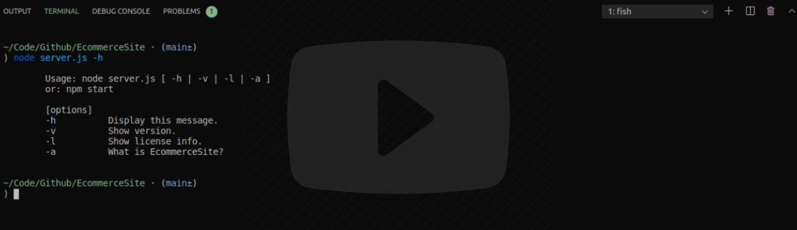
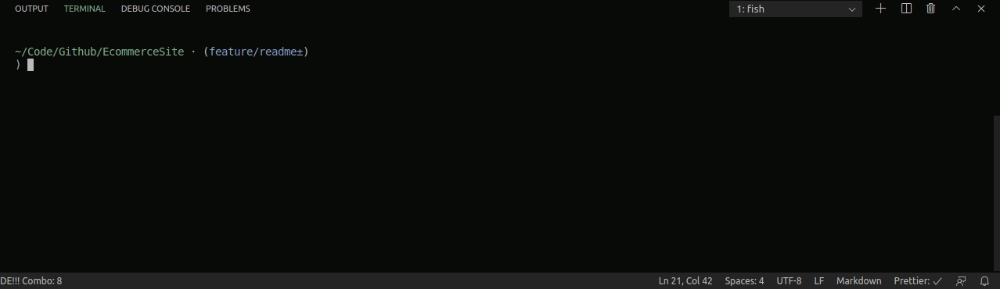
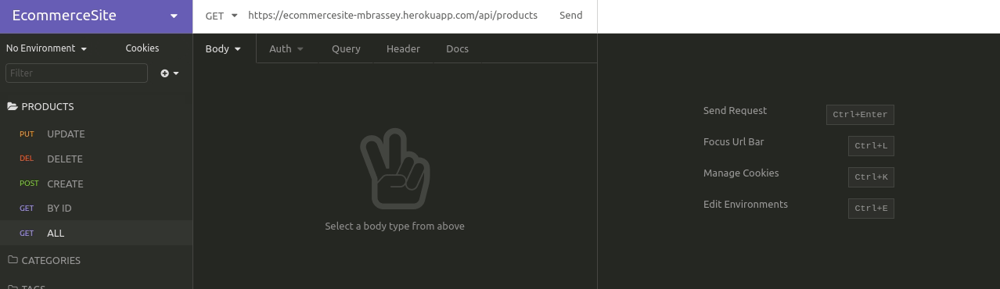
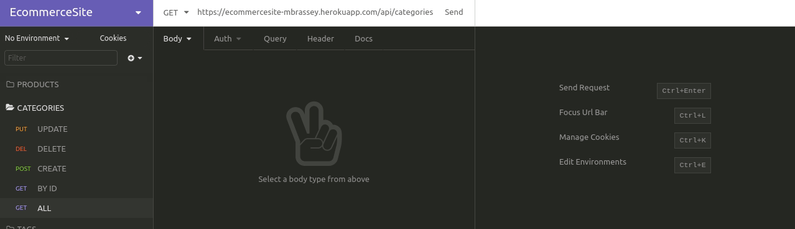
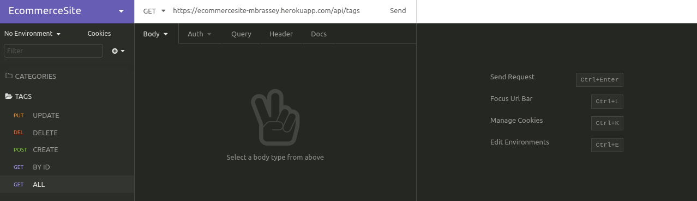

## EcommerceSite

E-Commerce backend with Express.js and SQL database. Including robust REST API with multiple endpoints/routes. Routes include POST, PUT, GET & DELETE for Tags, Categories and Products. All routes are tested in the demonstrations below.

#### Issues

- [x] [Initialize Application](https://github.com/MBrassey/EcommerceSite/issues/1)
- [x] [Construct All Models & Routes](https://github.com/MBrassey/EcommerceSite/issues/2)
- [x] [Deploy to Heroku & Generate Readme](https://github.com/MBrassey/EcommerceSite/issues/3)

#### Requirements

    mysql or jawsdb
    node
    npm

#### Installation

    Create file: .env (in root directory)
        DB_NAME='<your_database_name>'
        DB_USER='<your_user_name>'
        DB_PW='<your_mysql_password>'

    npm i
    npm run migrate
    npm run seed

#### Usage

    Usage: node server.js [ -h | -v | -l | -a ]
    or: npm start

    [options]

           -h          Display this message.
           -v          Show version.
           -l          Show license info.
           -a          What is EcommerceSite?

<h6>
:cyclone: Click the image(s) below to view the live <a id="Screenshots" href="https://EcommerceSite-mbrassey.herokuapp.com/api/categories">webapplication</a>
</h6>

> Video Demonstration
> 

> Setup
> 

> Product Routes
> 

> Category Routes
> 

> Tag Routes
> 

#### Questions

Contact me at [matt@brassey.io](mailto:matt@brassey.io) with any questions or comments.

#### License

`EcommerceSite` is published under the **CC0_1.0_Universal** license.

> The Creative Commons CC0 Public Domain Dedication waives copyright interest in a work you've created and dedicates it to the world-wide public domain. Use CC0 to opt out of copyright entirely and ensure your work has the widest reach. As with the Unlicense and typical software licenses, CC0 disclaims warranties. CC0 is very similar to the Unlicense.
